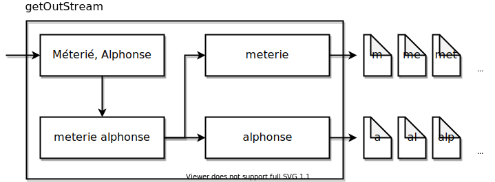

# Termennetwerk Fragmenter

Imagine a jQuery-style autocompletion widget without hardcoded data options, built using Linked Data. This project contains a proof of concept of such how the source data can be fragmented and hosted for such an application.

## Setup

1. Create a docker volume: `docker volume create fragments_volume`
   1. _Optional_: If a different volume name was chosen, update the volume mappings of both services in `docker-compose.yml`.
2. Gather all input data sources into one directory
   1. In `docker-compose.yml`, replace `/data/dumps/path` on line 7 with the chosen directory. This directory will be mounted as `/input` in the `files` container
3. Create `files/config.json`, using `files/example_config.json` as a template.
   1. `maxFileHandles` is the maximum number of open file handles the fragmenter may have open; 1024 is a common limit set by operating systems.
   2. `outDir` can remain unchanged, this is a mounted volume determined by `docker-compose.yml`
   3. `domain` is used as the root URI to base every fragment's identifier on, so is technically not just the domain but also the protocol, the base path, ... 
   4. `tasks` is a list of all datasets, and how they should be processed
      1. `input` is the path to the file, which should be in the `/input` directory as determined by `docker-compose.yml`
      2. `name` will become part of each fragment's path, to keep the fragmented datasets separate
      3. `properties` is a list of all predicate (URIs) to fragment this dataset on

Running `docker-compose build; docker-compose up` will then fragment all the given datasets, and serve them on `localhost:80`. 

Running `docker-compose up server` will skip fragmenting the data (again), and will only serve the existing data fragments.

## Structure

* `files/`
  * `Dockerfile`: creates a runnable docker container by compiling the java sources and copying the `config.json` file
  * `example_config.json`: template to create a `config.json` file from
  * `src/`: Java sources of the fragmenter
* `server/`
  * `Dockerfile`: copies the local `nginx.conf` into the default nginx container
  * `nginx.conf`: enables gzip compression, CORS, and caching headers
* `docker-compose.yml`: ensures that the `files` container writes to content root of the `server` container 

## Data Fragmentation

Input data is processed in 3 steps:

1. The data is parsed as an RDFStream from Apache Jena, each triple or quad is processed separately

2. Discovered literals are processed to obtain a set of fragment files to pipe the triples to

   1. The literal is normalized to [NFKD](http://www.unicode.org/reports/tr15/#Normalization_Forms_Table); filtered to just the Letters (L), Numbers (N) and Separator (Z) Unicode classes; and then lowercased

   2. The normalized literal is tokenized by whitespace

   3. Prefixes are extracted from each token

   4. A writable StreamRDF is returned for each prefix, and the triple/quad is written to them

       

3. Once all triples are processed, hypermedia links are added to the fragments

